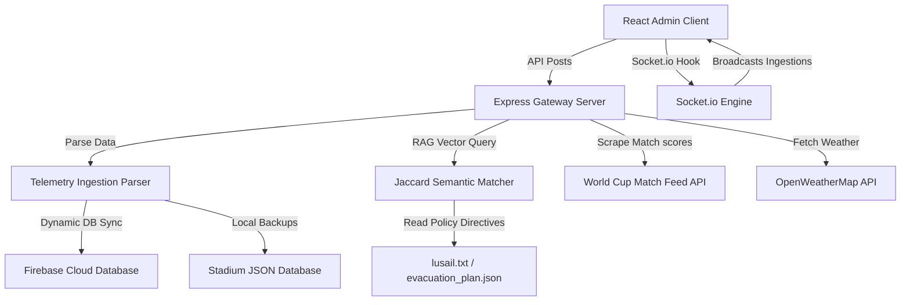

# VenueOS AI - Intelligent Stadium Operating System

VenueOS AI is a next-generation stadium management console designed to handle real-time telemetry, spectator flows, emergency dispatches, and semantic AI operations assistance. It is optimized for major sporting events, including the FIFA World Cup 2026.

---

## 1. System Architecture

The following sequence mapping represents the event-driven data flow of the VenueOS platform:



---

## 2. Key Modules & Technology Stack

### 📡 Core Gateways & Frameworks
- **Frontend Core**: React 18/19, Vite, Tailwind CSS, TypeScript, and Framer Motion.
- **Backend Infrastructure**: Node.js, Express, Socket.io, and Firebase Admin Client SDK.
- **Mapping & Wayfinding**: Leaflet.js rendering OpenStreetMap tiles. Prevents mount memory issues through synchronous cleanup refs.

### 🧠 Semantic AI & Ingestion
- **Local RAG Matcher**: Emulates high-throughput LLM semantic responses by tokenizing text documents and running local Jaccard similarity matches on policy files.
- **WebSocket Synchronization**: Ingested datasets dynamically emit WebSocket actions, updating widgets across active client consoles instantly.
- **Automated Schema Parser**: Parses CSV, JSON, and raw telemetry uploads to automatically map records to Matches, Incidents, or Sustainability structures.
- **PA Megaphone Vocalizer**: Leverages the browser Web Speech Synthesis API (`speechSynthesis`) to vocalize evacuation scripts and gate congestion alerts.

### ⚙️ External API Integrations
- **FIFA World Cup Live Feed**: Polls matches from the real-time `worldcup26.ir/get/games` API.
- **OpenWeatherMap Integration**: Ingests Lusail Stadium weather updates using user-provided API credentials.
- **Firebase Firestore Collections**: Real-time sync of active match configurations and security incidents.

---

## 3. Getting Started

### Prerequisites
Ensure you have Node.js (v18+) installed.

### Step 1: Start Backend Server
```bash
cd backend
npm install
npm run dev
```

### Step 2: Start Frontend Console
```bash
cd frontend
npm install
npm run dev
```
Navigate to [http://localhost:5173](http://localhost:5173) to view the console.
