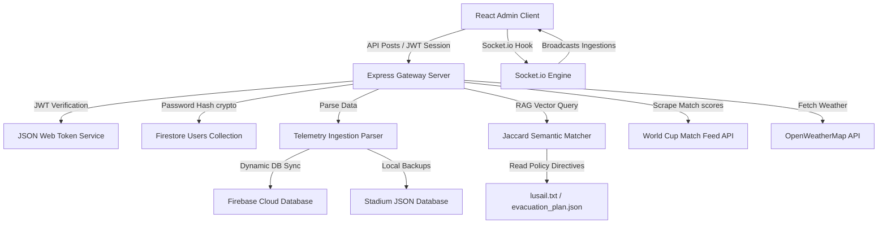

# VenueOS AI - Intelligent Stadium Operating System

VenueOS AI is a next-generation stadium management console designed to handle real-time telemetry, spectator flows, emergency dispatches, and semantic AI operations assistance. It is optimized for major sporting events, including the FIFA World Cup 2026.

---

## 1. System Architecture

The following sequence mapping represents the event-driven data flow of the VenueOS platform:



---

## 2. Key Modules & Technology Stack

### 🔒 Enterprise Authentication & Session Security
- **JWT Authentication**: Full JSON Web Token authentication system (`jsonwebtoken`) implemented on all private dashboard routes to manage operator sessions safely.
- **Password Protection**: Built-in SHA-256 password hashing via Node's native `crypto` library.
- **Registration & Role Access Control**: Register operator accounts with specialized roles (Operations, Security, Volunteer, Fan) dynamically linked to dashboard route permissions.
- **Google Federated SSO**: Simulation hub supporting single sign-on (SSO) authentication.
- **Server Hardening**: Configured `helmet` middleware inside Express to protect headers against common clickjacking, MIME sniffing, and cross-site scripting vulnerabilities.

### 🍃 Sustainability Gamification (Green Fan Scorecard)
- **Live Scoreboard**: Spectators tick actions (Metro transit, smart recycling bin usage, water refills, vegetarian meals) to log carbon offsets in real-time.
- **Badging Engine**: Grants achievement tiers (**Green Recruit** ➔ **Eco Explorer** ➔ **Carbon Crusher Pro**).
- **AI Sustainability Coach**: Utilizes the GenAI chat interface to analyze fan logs and stream 2 customized mitigation tips.

### 🎫 AI Seat & Ticket Wayfinding Assistant
- **Ticket Locator Parser**: Parses ticket locator configurations (e.g. `GATE-A-SEC102-ROW5` / `GATE-D-SEC102-WHEELCHAIR-ACCESSIBLE`).
- **WCAG Step-Free Wayfinding**: Queries the RAG-grounded AI model to highlight step-free companion routes, ADA ramp locations, and elevators for wheelchair users.
- **Interactive Leaflet Mapping**: Renders route polylines and markers on Leaflet maps and pans to bounds on selection.

### 📡 Core Gateways & Frameworks
- **Frontend Core**: React 18/19, Vite, Tailwind CSS, TypeScript, and Framer Motion.
- **Backend Infrastructure**: Node.js, Express, Socket.io, and Firebase Admin Client SDK.
- **Visual Overrides**: Custom accessibility configurations for Sunlight High-Contrast and Text Scaling (Standard, Medium, Large) applied globally.

### ⚙️ External API Integrations
- **FIFA World Cup Live Feed**: Polls matches from the real-time `worldcup26.ir/get/games` API.
- **OpenWeatherMap Integration**: Ingests Lusail Stadium weather updates using user-provided API credentials.
- **Firebase Firestore Collections**: Real-time sync of active match configurations, security incidents, and user authentication tables.

---

## 3. Automated Test Suites

The project features a double-verification testing environment:
- **Backend Tests (Jest)**: Unit tests for AI streaming emulation fallbacks and statistic calculations (`npm run test`).
- **Frontend Tests (Vitest)**: Verification suite for translation keys and configuration limits (`npm run test`).

---

## 4. Getting Started

### Prerequisites
Ensure you have Node.js (v18+) installed.

### Step 1: Start Backend Server
```bash
cd backend
npm install
npm run dev
```

### Step 2: Start Frontend Console
```bash
cd frontend
npm install
npm run dev
```
Navigate to [http://localhost:5173](http://localhost:5173) to view the console.
